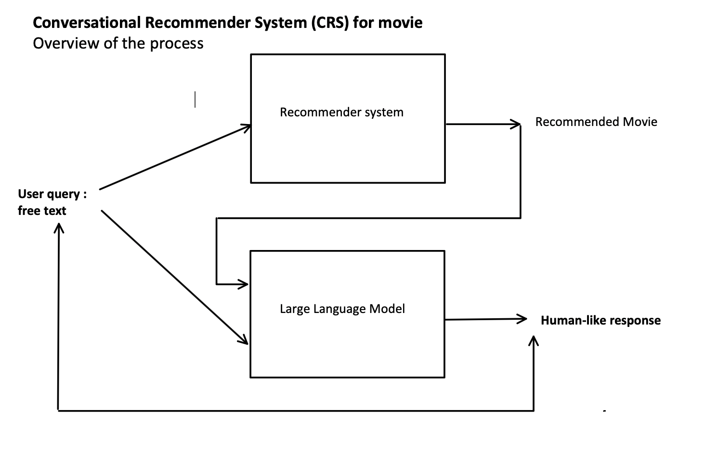

# CineBot
Our group project aims to develop a movie recommendation system with a conversational interface using natural language processing (NLP) techniques.   
The system consists of a recommender system to suggest movies based on user preferences. 
The user will first answer a few questions to filter out his preference ( length of the movie, genre, old or new,... )  
Then the chatbot will incentive the user to explain his need in free text, describing a certain type of movie, or the feeling he wants to have.  
This free text will be analysed with the NLP technique to provide a meaningful recommendation.  
Additionally, it will incorporate a Large Language Model (LLM) to provide interactive and more human-like responses to user queries and enhance the overall user experience.   
It is also possible that the user continue the conversation and in this case, the overall process will repeat until the user is satisfied.
Finally, a User Interface (UI) will be implemented to provide the user with the most enjoyable experience.




# Steps to run
```
npm run start
npm run start-api
```